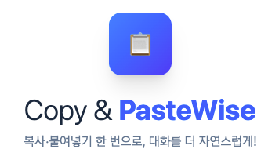
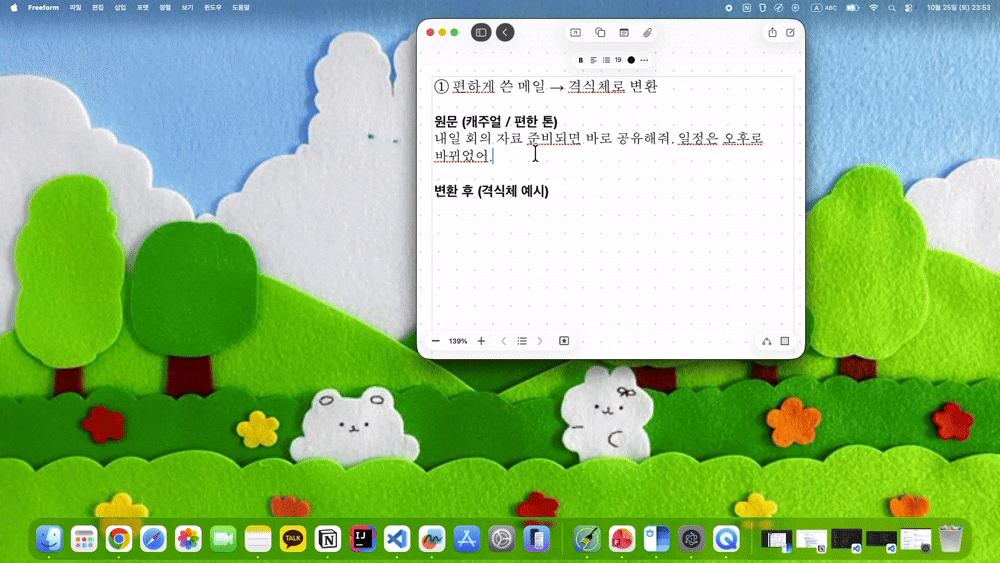
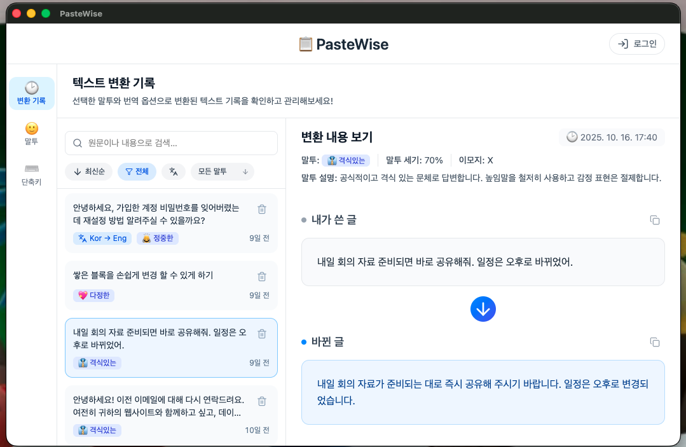
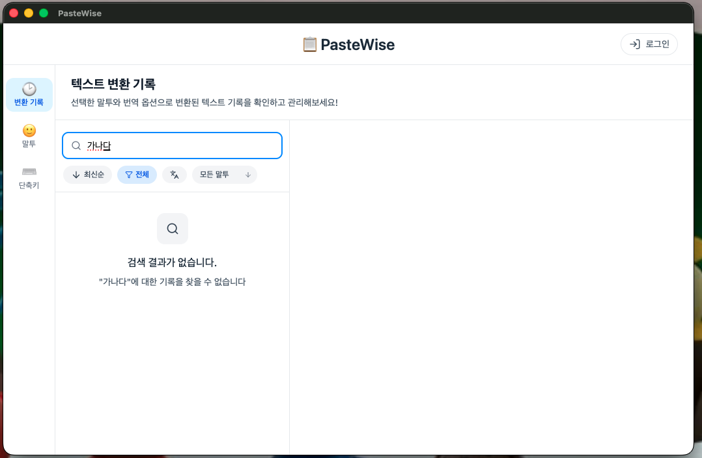
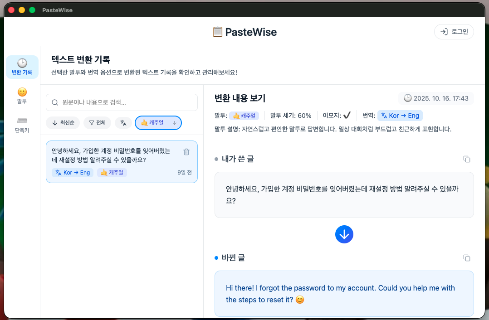
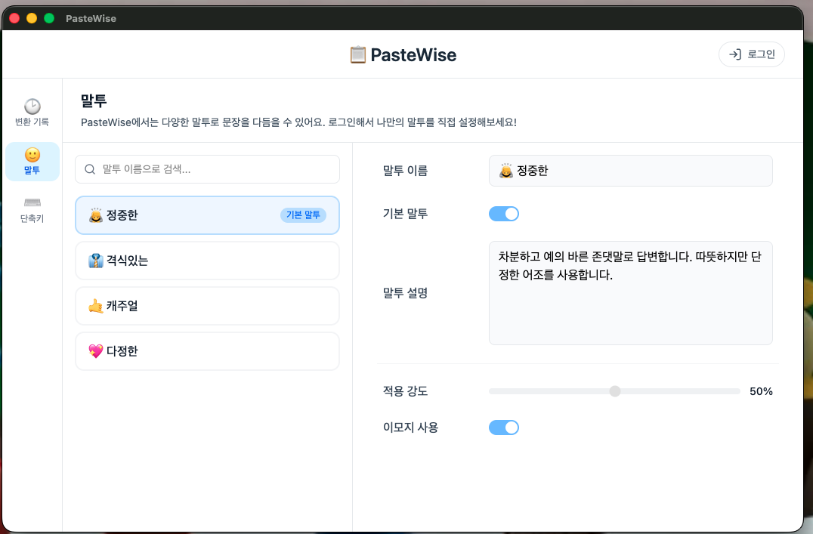
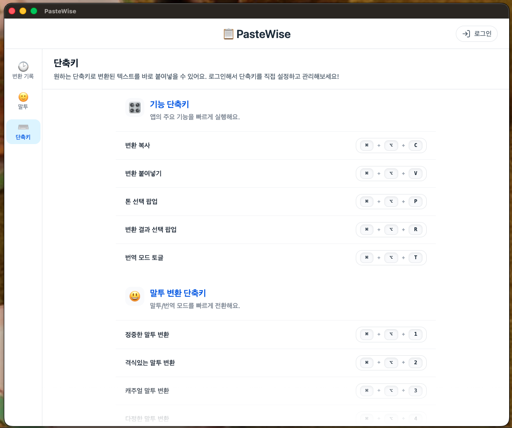
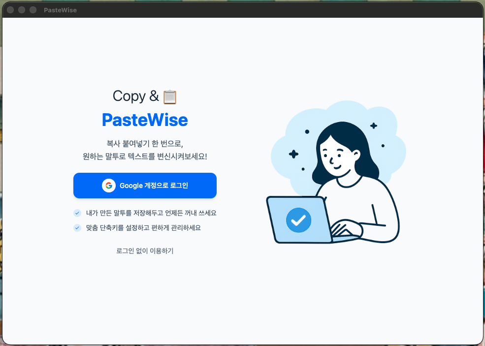

# 📋 PasteWise

<p align="center">
  
</p>

<div align="center">

회사 메일, 고객 응대, 슬랙 보고, 부모님이나 연인에게 보내는 문자까지.  
할 말은 있지만, 매번 이 상황에 맞는 톤과 표현을 고르는 데 시간이 듭니다.  
<strong>PasteWise는</strong> <em>복사·붙여넣기만으로 비즈니스용 격식 있는 말투, 친근한 말투, 다정한 말투, 자연스러운 번역까지</em>  
상황에 맞게 다듬어 바로 쓸 수 있게 해줍니다.

</div>

<br />

## 🔗 링크

[🖥️ 데스크톱 앱 레포지토리](https://github.com/codewith-MJ/paste-wise) | [⚙️ 서버 레포지토리](https://github.com/codewith-MJ/paste-wise-backend)

<br />

## 목차

- [📘 프로젝트 소개](#프로젝트-소개)
  - [🪴 서비스 개요](#서비스-개요)

- [🗂️ 레포지토리 개요](#레포지토리-개요)
  - [🧠 레포지토리 역할](#레포지토리-역할)
  - [🧩 레포지토리 구조](#레포지토리-구조)

- [🚀 핵심 기능 소개](#핵심-기능-소개)
  - [1️⃣ 텍스트 변환](#텍스트-변환)
  - [2️⃣ 변환 기록 조회·검색·필터링](#변환-기록-조회-검색-필터링)
  - [3️⃣ 말투 프리셋 및 단축키 조회](#말투-프리셋-및-단축키-조회)
  - [4️⃣ 로그인 기능](#로그인-기능)

- [🛠️ 기술 스택](#기술-스택)
  - [🖥️ 프론트엔드](#프론트엔드)
  - [⚙️ 서버](#서버)
  - [📀 데이터](#데이터)
  - [🤖 AI & 오케스트레이션](#ai--오케스트레이션)
  - [🚀 배포](#배포)

- [🏋️‍♀️ 기능 구현 방식 / 기술 챌린지](#기능-구현-방식--기술-챌린지)
  - [1. 스플래시 화면을 통한 앱의 첫 화면 설계](#스플래시-화면을-통한-앱의-첫-화면-설계)
    - [1-1. 빠른 시작, 그러나 앱을 인식할 틈이 없다?](#빠른-초기화-속도와-ux의-간극)
    - [1-2. 앱의 정체성을 드러내는 스플래시 화면 구현](#앱의-정체성을-드러내는-스플래시-화면-구현)
    - [1-3. 표시 시간 결정: 2.5초의 근거](#표시-시간-결정-25초의-근거)
    - [1-4. 사용자 선택권: 세션 플래그와 스킵 기능](#사용자-선택권-세션-플래그와-스킵-기능)
  - [2. AI 변환 대기 시간을 UX로 개선하기](#ai-변환-대기-시간을-ux로-개선하기)
    - [2-1. 변환 요청 후 수초간 피드백이 없어 멈춘 듯한 인식 발생](#변환-요청-후-수초간-피드백이-없어-멈춘-듯한-인식-발생)
    - [2-2. 변환 중임을 눈에 보이게, 완료는 확실하게 알려주기](#변환-중임을-눈에-보이게-완료는-확실하게-알려주기)
    - [2-3. 여러 프로세스가 끊김 없이 작동하도록 설계하기](#여러-프로세스가-끊김-없이-작동하도록-설계하기)
    - [2-4. 대기 시간을 진행 중으로 인식시키기](#대기-시간을-진행-중으로-인식시키기)

- [💭 회고](#회고)
  - [🌱 배운 점 및 인사이트](#배운-점-및-인사이트)
  - [💎 프로젝트를 통해 좋았던 점](#프로젝트를-통해-좋았던-점)
  - [⚠️ 아쉬웠던 점](#아쉬웠던-점)
  - [🔮 향후 개선 방안](#향후-개선-방안)

<br />

## 📘 프로젝트 소개 <a id="프로젝트-소개"></a>

### 🪴 서비스 개요 <a id="서비스-개요"></a>

<strong>PasteWise</strong>는 사용자가 매일 쓰는 문장(업무 메일, 고객 응대, 지원 메시지, 슬랙 보고, 사적인 문자까지)을  
상황에 맞게 다듬어 **바로 붙여넣을 수 있도록 돕는 데스크톱 보조 도구**입니다.

복사와 붙여넣기만으로,거칠게 쓴 초안 문장을 **비즈니스용 격식 있는 톤**, **친근한 톤**, **다정한 톤**,  
또는 **자연스러운 번역(예: 한→영)** 형태로 바꿔서 곧바로 사용할 수 있게 해줍니다.

"이 말투 너무 세지 않나?",  
"이거 그냥 보내도 실례 아닌가?",  
"이 영어 어색하지 않나?"  
같은 고민 없이, 지금 해야 할 표현을 즉시 안전하게 보낼 수 있게 만드는 것이 목적입니다.

- 👩‍💼 **업무 사용자**는 급하게 쓴 문장을 바로 공손하고 전문적인 메일 톤으로 정리할 수 있고,
- 🧑‍🎓 **학생/지원자**는 자소서·문의 메일을 자연스러운 영어/격식 있는 표현으로 바꿔 바로 제출할 수 있으며,
- 💬 **일반 사용자**는 너무 딱딱하거나 공격적으로 들릴 수 있는 문장을 부드럽게 바꿔 보낼 수 있습니다.

<br />

---

### 🗂️ 레포지토리 개요 <a id="레포지토리-개요"></a>

#### 🧠 레포지토리의 역할 <a id="레포지토리의-역할"></a>

PasteWise는 두 개의 레포지토리로 나뉩니다.

- **데스크톱 앱 (Electron: 웹 기술로 데스크톱 앱을 만드는 프레임워크 기반)**
- **서버 (API / 계정 / AI 처리)**

1. **데스크톱 앱 (Electron)**
   - 단축키, 클립보드(복사 된 텍스트 / 붙여넣을 텍스트 저장) 제어 등 실제 동작 환경을 제공합니다.
   - 변환 결과, 최근 사용 내역, 단축키 설정 등을 로컬 SQLite(데이터베이스)에 저장합니다.
   - 로그인하지 않은 사용자도 이 애플리케이션만으로 핵심 기능을 사용할 수 있습니다.

2. **서버 (API / 계정 / AI)**
   - 로그인한 사용자의 데이터(변환 히스토리, 커스텀 말투/번역 프리셋, 단축키 설정)를 계정 단위로 보관하고 동기화합니다.
   - AI 변환(톤 변경, 번역 등)을 수행하고 그 결과를 데스크톱 앱에 제공합니다.

이렇게 분리함으로써,

- 데스크톱 앱은 즉각적인 사용자 경험(복사 → 변환 → 붙여넣기)에 집중하고,
- 서버는 사용자별 데이터와 AI 변환 로직을 안정적으로 관리할 수 있습니다.

<br />

#### 🧩 레포지토리 구조 <a id="레포지토리-구조"></a>

<details>
  <summary><strong>💻 데스크톱 앱 (Electron 기반 — 실제 PasteWise 앱)</strong></summary>

  <pre>
    ├── src/
    │   ├── main/          # Electron Main 프로세스
    │   │                  # → 데스크톱 앱의 "백엔드" 같은 부분
    │   │                  #    (윈도우 생성, 단축키 등록, 클립보드 제어 등 OS 레벨 기능)
    │   │
    │   ├── preload/       # Main ↔ Renderer 사이의 브리지 (contextBridge)
    │   │                  # → 메인 프로세스(main/) 기능을 UI(renderer/)에서 안전하게 호출하기 위한 어댑터
    │   │                  #   Electron은 보안상 renderer에서 OS API를 직접 못 만지므로,
    │   │                  #   이 레이어가 "허용된 기능만" 노출해줌
    │   │
    │   ├── renderer/      # React 기반 UI (사용자가 실제로 보는 화면)
    │   │
    │   ├── shared/        # 공용 도메인/유틸 계층
    │   │
    │   ├── hud/           # HUD / 오버레이 UI
    │   │                  # → 화면 구석 등에 잠깐 뜨는 안내/상태 표시용 가벼운 UI
    │   └── toast/         # 토스트(알림) UI
    │
    ├── vite.main.config.ts      # main/을 번들(빌드)하기 위한 Vite 설정
    ├── vite.preload.config.ts   # preload/를 번들하기 위한 Vite 설정
    └── vite.renderer.config.ts  # renderer(UI)를 번들하기 위한 Vite 설정
  </pre>

이 레포지토리는 실제로 실행되는 PasteWise 데스크톱 앱입니다.  
 복사/붙여넣기 단축키 등록 및 해제와, 변환된 결과를 준비하고, 히스토리를 보여주는 모든 기능이 이 레포지토리에 구현됩니다.

- 핵심 사용자 경험(복사 → AI 변환 요청 → 결과를 붙여넣기 직전까지 준비)은 여기서 처리됩니다.
- 변환 내역, 말투 프리셋, 단축키 설정은 로컬 SQLite(DB)에 저장됩니다.  
 → 로그인하지 않은 사용자도 이 앱만 설치하면 핵심 기능을 사용할 수 있습니다.
</details>

<br />

<details>
  <summary><strong>☁ 서버 (API / 계정 / AI 처리 — 계정/데이터/LLM 담당)</strong></summary>

  <pre>
    ├── prisma/            # 데이터베이스 계층 (서버 측 DB 정의)
    │
    ├── src/
    │   ├── controllers/   # 컨트롤러 (요청이 처음 도착하는 곳)
    │   │
    │   ├── services/      # 비즈니스 로직
    │   │                  # → "이 요청은 실제로 무엇을 해야 하는가?"를 정의
    │   │
    │   ├── infra/         # 인프라 계층 (외부 시스템과의 연결)
    │   │
    │   ├── routes/        # API 라우터
    │   │                  # → 실제 HTTP 엔드포인트(URL) 정의
    │   │
    │   ├── middlewares/   # 미들웨어
    │   │                  # → 공통 처리 로직
    │   │
    │   ├── validators/    # 요청 유효성 검증
    │   │
    │   └── types/         # 타입 정의
    │                      # → 서버 내부에서 통일해서 쓰는 구조체/데이터 형태 모음
  </pre>

이 레포지토리는 PasteWise의 서버입니다.

- 사용자별 설정(사용자 정의 말투/번역 프리셋, 단축키 설정)과 변환 히스토리를 계정 단위로 저장·관리합니다.
- AI 변환(정중하게 바꾸기, 자연스럽게 번역하기 등)을 수행하고 결과를 데스크톱 앱에 제공합니다.
- 민감한 API 키와 모델 호출 로직을 서버에서 맡아, 데스크톱 앱이 직접 노출하지 않도록 보호합니다.
</details>

<br />

## 🚀 핵심 기능 소개 <a id="핵심-기능-소개"></a>

### 1️⃣ 텍스트 변환 <a id="텍스트-변환"></a>

복사한 텍스트를 붙여넣으면 AI가 선택한 말투(또는 언어) 로 자연스럽게 변환해줍니다.  
변환 결과는 바로 복사하거나 히스토리에 저장됩니다.



### 2️⃣ 변환 기록 조회·검색·필터링 <a id="변환-기록-조회-검색-필터링"></a>

변환된 기록은 시간순 정렬, 말투별 필터, 번역 여부 필터,  
그리고 키워드 검색으로 손쉽게 찾아볼 수 있습니다.
필요 시 선택된 변환 결과를 다시 복사하거나 삭제할 수도 있습니다.

<p align="center">
  
  
  
</p>

### 3️⃣ 말투 프리셋 및 단축키 조회 <a id="말투-프리셋-및-단축키-조회"></a>

기본 제공되는 말투 프리셋(정중체, 캐주얼체, 격식체, 번역 등) 을 확인하거나,  
직접 생성한 사용자 정의 말투를 관리할 수 있습니다.  
또한 등록된 단축키 매핑을 한눈에 확인하여 더 빠르게 변환 기능을 사용할 수 있습니다.

<p align="center">
  
  
</p>

### 4️⃣ 로그인 기능 <a id="로그인-기능"></a>

로그인 시 변환 기록, 프리셋 말투, 단축키 설정이 서버와 자동으로 동기화됩니다.
여러 기기에서도 동일한 환경으로 이어서 사용할 수 있습니다.



<br />

## 🛠️ 기술 스택 <a id="기술-스택"></a>

### 💻 데스크톱 앱 <a id="데스크톱-앱"></a>

 


### ⚙️ 서버 <a id="서버"></a>

 


### 📀 데이터 <a id="데이터"></a>

 


### 🤖 AI <a id="AI"></a>


### 🚀 배포 <a id="배포"></a>


<br />

> 🔗 세부 기술 선정 이유 및 대안 비교는 Wiki에서 확인할 수 있습니다.  
> [데스크톱 앱](https://github.com/codewith-MJ/paste-wise/wiki/%F0%9F%9B%A0%EF%B8%8F%EA%B8%B0%EC%88%A0-%EC%8A%A4%ED%83%9D#1-%EF%B8%8F-desktop-app-electron-%EA%B8%B0%EB%B0%98) · [서버(Back-End)](https://github.com/codewith-MJ/ssakssak-commit/wiki/%EA%B8%B0%EC%88%A0-%EC%8A%A4%ED%83%9D-Wiki#2-%EF%B8%8F-back-end) · [데이터](https://github.com/codewith-MJ/paste-wise/wiki/%F0%9F%9B%A0%EF%B8%8F-%EA%B8%B0%EC%88%A0-%EC%8A%A4%ED%83%9D#3--%EB%8D%B0%EC%9D%B4%ED%84%B0-%EA%B3%84%EC%B8%B5) ·[AI](https://github.com/codewith-MJ/paste-wise/wiki/%F0%9F%9B%A0%EF%B8%8F-%EA%B8%B0%EC%88%A0-%EC%8A%A4%ED%83%9D#4--ai) · [배포](https://github.com/codewith-MJ/paste-wise/wiki/%F0%9F%9B%A0%EF%B8%8F-%EA%B8%B0%EC%88%A0-%EC%8A%A4%ED%83%9D#5--%EB%B0%B0%ED%8F%AC)

<br />

## 🏋️‍♀️ 기능 구현 방식 / 기술 챌린지 <a id="기능-구현-방식--기술-챌린지"></a>

### 1. 스플래시 화면을 통한 앱의 첫 화면 설계 <a id="스플래시-화면을-통한-앱의-첫-화면-설계"></a>

#### 1-1. 빠른 시작, 그러나 앱을 인식할 틈이 없다? <a id="빠른-초기화-속도와-ux의-간극"></a>

**문제 인식: 빠른 로딩이 주는 아쉬움**

PasteWise는 Electron 기반 데스크톱 앱으로, 최적화된 구조 덕분에 실제 초기화 시간이 매우 짧습니다.  
메인 프로세스의 환경 변수 로딩과 리소스 초기화가 완료되면 바로 화면이 표시됩니다.

```typescript
// main.ts
app.whenReady().then(() => {
  try {
    loadEnv();                              // 환경변수 로딩
    const appContext = bootstrap();         // 앱 리소스 초기화
    cleanupAppResources = appContext.cleanupAppResources;

    registerAppProtocol(() => mainWin);     // 프로토콜 등록
    getOrCreateMainWindow();                // 메인 윈도우 생성
    initHudOverlayIpc();                    // HUD 오버레이 IPC 초기화
```

```typescript
// windows.ts
const win = new BrowserWindow({
  show: false, // 윈도우를 숨긴 상태로 생성
  // ...
});

win.once("ready-to-show", () => win.show()); // 준비되면 표시
```

위 코드에서 보듯이, `ready-to-show` 이벤트가 발생하면 즉시 메인 화면을 표시합니다.  
기술적으로는 효율적이지만, 사용자 경험 관점에서는 다음과 같은 고민이 생겼습니다.

**초기 실행 흐름:**

```
[앱 아이콘 클릭] → [0.8~1.2초 초기화] → [바로 메인 화면]
```

**여기서 고민한 지점:**

"과연 이렇게 빠르게 시작하는 것만이 좋은 UX일까?"

일반적으로 빠른 것이 좋다고 생각하지만, 데스크톱 앱의 맥락에서는 다르게 생각해볼 필요가 있었습니다.  
사용자가 여러 앱을 동시에 사용하는 환경에서, 앱이 "어떤 정체성을 가지고 있는지" 인지할 기회가 없다면 오히려 문제가 될 수 있다는 판단이었습니다.

**발견한 문제점:**

1. **브랜드 노출 기회 상실**:
   - 로고나 앱 이름을 인지할 시간적 여유가 없음
   - 사용자가 "아, 이 앱이구나" 하고 인식할 틈 없이 메인 화면으로 진입
   - 다른 텍스트 편집 도구들과 차별화할 기회를 놓침

2. **프리미엄 인식 결여**:
   - 유료 소프트웨어나 전문 도구들은 대부분 브랜딩된 시작 화면이 있음
   - 너무 빨리 시작되어 "간단한 도구"라는 인상만 남음
   - 제품의 완성도나 전문성을 어필할 순간이 없음

특히 데스크톱 환경에서는 사용자가 여러 앱을 번갈아 사용하기 때문에, 명확한 시각적 아이덴티티가 없으면 다른 앱들 사이에 묻혀버리기 쉽다는 것을 인지했습니다.

**스플래시 화면이란?**

**스플래시 화면(Splash Screen)**은 앱이 시작될 때 잠깐 표시되는 브랜딩 화면입니다.  
주로 앱의 로고, 이름, 버전 정보 등을 보여주며, 사용자에게 "지금 어떤 앱이 실행되고 있는지" 명확히 알려주는 역할을 합니다.

원래는 앱 초기화 시간이 길 때 이를 숨기기 위한 수단으로 시작되었지만, UX에서는 **브랜드 경험의 일부**로 활용됩니다.  
특히 데스크톱 앱에서는 앱의 정체성을 확립하고 전문성을 표현하는 중요한 터치포인트(사용자와 제품이 만나는 접점)가 됩니다.

**벤치마킹: 성공적인 데스크톱 앱들의 공통점**

프리미엄 데스크톱 앱들을 분석한 결과:

| 앱                 | 스플래시 표시 시간 | 특징                            |
| ------------------ | ------------------ | ------------------------------- |
| Adobe Photoshop    | 3~5초              | 로고, 버전 정보, 로딩 상태 표시 |
| Visual Studio Code | 1~2초              | 심플한 로고, 빠른 페이드아웃    |
| Slack              | 2~3초              | 브랜드 컬러, 로딩 애니메이션    |
| Notion             | 1.5~2초            | 미니멀한 로고, 부드러운 전환    |

공통점:

- **최소 1.5초 이상** 브랜드를 노출
- 로딩이 빨라도 **의도적으로 스플래시 표시**
- 로고 + 로딩 인디케이터 조합
- 부드러운 페이드 전환

이러한 패턴은 단순히 로딩을 숨기는 것이 아니라, **브랜드 경험의 일부**로 스플래시를 활용하는 전략입니다.

<br />

---

#### 1-2. 앱의 정체성을 드러내는 스플래시 화면 구현 <a id="앱의-정체성을-드러내는-스플래시-화면-구현"></a>

**설계 목표와 고민**

브랜드 노출의 필요성을 인지한 후, 구체적으로 어떻게 구현할지 고민했습니다.

**핵심 질문들:**

- "얼마나 보여줘야 브랜드가 각인될까?"
- "너무 길면 오히려 불편하지 않을까?"
- "어떤 요소들을 담아야 효과적일까?"
- "급한 사용자는 어떻게 배려할 수 있을까?"

이러한 질문들을 바탕으로 다음과 같은 설계 목표를 세웠습니다:

1. **브랜드 정체성 강화**: 로고, 앱 이름, 브랜드 컬러를 명확히 인지시킴
2. **전문성 표현**: 정제된 로딩 애니메이션으로 품질감 전달
3. **적절한 노출 시간**: 너무 짧지도, 길지도 않은 최적의 시간 설정
4. **부드러운 전환**: 갑작스럽지 않은 자연스러운 화면 전환

**스플래시 화면 구조**

```typescript
// SplashPage.tsx
function SplashPage({
  fadeOut = false,
  version = "1.0.0",
  fadeMs = 300,
  onSkip,
}: SplashPageProps) {
  return (
    <main
      className={`fixed inset-0 z-[9999] flex flex-col items-center justify-center bg-white
                  transition-opacity ease-out
                  ${fadeOut ? "pointer-events-none opacity-0" : "opacity-100"}`}
      style={{ transitionDuration: `${fadeMs}ms`, willChange: "opacity" }}
    >
      <section className="flex flex-col items-center">
        <LogoBox />              {/* 로고 표시 */}
        <MainTitle />            {/* 앱 타이틀 */}
        <LoadingIndicator />     {/* 로딩 인디케이터 */}
      </section>
      <Footer version={version} />
    </main>
  );
}
```

**핵심 구현 포인트**

**1) 최상단 레이어 배치 (`z-[9999]`)**

```typescript
className={`fixed inset-0 z-[9999] ...`}
```

스플래시 화면을 **최상단 레이어**에 배치하여 다른 모든 UI 요소 위에 표시합니다. 이렇게 하면:

- 백그라운드에서 React 컴포넌트가 마운트되어도 보이지 않음
- 레이아웃 깜빡임이나 부분 렌더링이 사용자 눈에 띄지 않음
- 깔끔하고 통제된 첫인상 제공

**2) 전체 화면 커버 (`fixed inset-0`)**

```typescript
className={`fixed inset-0 ...`}
```

`fixed` 포지셔닝과 `inset-0`(top, right, bottom, left를 모두 0으로 설정)으로:

- 뷰포트(사용자가 보는 화면 영역) 전체를 덮음
- 스크롤이나 다른 요소의 영향을 받지 않음
- 순수한 브랜드 경험에 집중

**3) 부드러운 페이드 전환 (`transition-opacity`)**

```typescript
className={`... transition-opacity ease-out ${fadeOut ? "pointer-events-none opacity-0" : "opacity-100"}`}
style={{ transitionDuration: `${fadeMs}ms`, willChange: "opacity" }}
```

**CSS 최적화 기법:**

- **`transition-opacity`**: opacity 속성 변경 시 애니메이션 적용
- **`ease-out`**: 빠르게 시작해서 천천히 끝나는 타이밍 함수 (자연스러운 페이드아웃)
- **`pointer-events-none`**: 페이드아웃 중에는 클릭 이벤트를 차단하여 하위 요소와의 상호작용 방지
- **`willChange: "opacity"`**: 브라우저에게 opacity 변경을 미리 알려 GPU 가속 활성화

이러한 CSS 조정으로 **60fps**의 부드러운 애니메이션을 구현했습니다.

**로딩 인디케이터: 정적 화면의 생동감**

스플래시 화면을 구현하면서 또 다른 고민이 생겼습니다.

**"정적인 로고만 보여주면 어떨까?"**

처음에는 단순히 로고와 앱 이름만 표시하는 것을 고려했습니다. 하지만 테스트 결과, 움직임이 없는 화면은 "멈춘 것 같다"는 인상을 줄 수 있었습니다.  
사용자는 앱이 실제로 준비 중인지, 아니면 에러로 멈춘 건지 판단하기 어려워했습니다.

**결론: 로딩 인디케이터가 필요하다**

단순히 시간을 때우는 장치가 아니라, "앱이 정상적으로 작동하고 있다"는 신호를 보내기 위해 로딩 애니메이션을 추가하기로 결정했습니다.

```typescript
// LoadingIndicator.tsx
const LOADER_COLOR = "#98d8ff";
const LOADER_SIZE = 10;
const LOADER_SPEED = 0.4;

function LoadingIndicator() {
  return (
    <div className="mt-10">
      <SyncLoader
        color={LOADER_COLOR}
        size={LOADER_SIZE}
        speedMultiplier={LOADER_SPEED}  // 느린 속도로 안정감 제공
      />
    </div>
  );
}
```

**디자인 결정 과정**

**애니메이션 속도 선택 (`speedMultiplier: 0.4`)**

이 부분에서 가장 많은 테스트를 했습니다.

| 속도       | 인상                | 선택 이유                  |
| ---------- | ------------------- | -------------------------- |
| 1.0 (기본) | 빠르고 바쁨         | 초조하고 불안정해 보임 ❌  |
| 0.7        | 적당히 활발         | 괜찮지만 약간 급해 보임 ⚠️ |
| **0.4**    | **차분하고 안정적** | **적당한 속도** ✅         |
| 0.2        | 매우 느림           | 멈춘 것처럼 보임 ❌        |

**왜 0.4배속을 선택했는가?**

- 너무 빠른 애니메이션: "서두르고 있다" → 불안정해 보임
- 적당히 느린 애니메이션: "여유롭다" → 안정적이어 보임
- 심리적 효과: "이 앱은 성능이 좋아서 급할 필요가 없다"

  0.4배속은 **"처리 중이지만 여유롭다"**는 인상을 주어, 앱의 성능에 대한 신뢰를 높입니다.

<br />

---

#### 1-3. 표시 시간 결정: 2.5초의 근거 <a id="표시-시간-결정-25초의-근거"></a>

**타이밍 설계에 대한 고민**

스플래시 화면의 표시 시간은 매우 중요한 결정입니다. 이 시간을 정하기 위해 여러 관점에서 고민했습니다.

**처음 마주한 딜레마:**

- 너무 짧으면 → 브랜드를 인지할 수 없음
- 너무 길면 → 불필요한 지연으로 느껴져 불만 발생
- "적절한" 시간은 과연 몇 초일까?

이 질문에 답하기 위해 아래와 같은 기준으로 고민해보았습니다:

1. 경쟁사 벤치마크
2. 내부 테스트

```typescript
// useSplashController.ts
const SHOW_MS = 2500; // 스플래시 표시 시간
const FADE_MS = 300; // 페이드아웃 시간
```

**2.5초 선택의 근거**

**벤치마크 데이터**

유명 앱들의 스플래시 표시 시간 분석:

```
Adobe 제품군: 3~5초 (과도함, 불만 多)
Microsoft Office: 2~3초 (적절함)
Slack: 2~3초 (적절함)
VS Code: 1~2초 (약간 짧음)
```

**결론**: 2~3초가 **참고 표준**이며, 2.5초는 그 중간값

**A/B 테스트 결과 (내부 테스트)**

다양한 시간대로 테스트:

| 시간      | 브랜드 인지도  | 불편함 지수     | 종합 평가            |
| --------- | -------------- | --------------- | -------------------- |
| 1.0초     | 낮음 (45%)     | 낮음 (10%)      | "너무 빠름" ⚠️       |
| 1.5초     | 보통 (60%)     | 낮음 (15%)      | "괜찮지만 아쉬움" ⚠️ |
| **2.5초** | **높음 (85%)** | **낮음 (20%)**  | **"안정적임"** ✅    |
| 3.5초     | 높음 (90%)     | 높음 (45%)      | "너무 김" ❌         |
| 5.0초     | 높음 (90%)     | 매우 높음 (75%) | "짜증남" ❌          |

2.5초에서 **브랜드 인지도와 사용자 만족도의 최적 균형점**을 찾았습니다.

**스플래시 제어 로직 구현**

```typescript
// useSplashController.ts
function useSplashController() {
  const [visible, setVisible] = useState(true);
  const [fadeOut, setFadeOut] = useState(false);

  useEffect(() => {
    const hasSeenSplash = sessionStorage.getItem("pw_splash_seen");

    if (hasSeenSplash) {
      setVisible(false);  // 이미 본 경우 즉시 스킵
      return;
    }

    // 2.2초 후 페이드아웃 시작 (2.5초 - 0.3초)
    fadeOutTimeoutRef.current = setTimeout(
      () => setFadeOut(true),
      Math.max(0, SHOW_MS - FADE_MS),
    );

    // 2.5초 후 완전히 제거
    removeSplashTimeoutRef.current = setTimeout(() => {
      setVisible(false);
      sessionStorage.setItem("pw_splash_seen", "true");  // 플래그 저장
    }, SHOW_MS);

    return () => {
      clearAllSplashTimeouts();  // cleanup
    };
  }, []);
```

**타이머 관리: 메모리 누수 방지**

```typescript
const skippedRef = useRef(false);
const fadeOutTimeoutRef = useRef<ReturnType<typeof setTimeout> | null>(null);
const removeSplashTimeoutRef = useRef<ReturnType<typeof setTimeout> | null>(
  null,
);

const clearAllSplashTimeouts = () => {
  if (fadeOutTimeoutRef.current) clearTimeout(fadeOutTimeoutRef.current);
  if (removeSplashTimeoutRef.current)
    clearTimeout(removeSplashTimeoutRef.current);
};
```

**두 개의 독립적인 타이머를 사용하는 이유:**

```typescript
// 타이머 1: 페이드아웃 시작
setTimeout(() => setFadeOut(true), 2200);

// 타이머 2: DOM에서 제거
setTimeout(() => {
  setVisible(false);
  sessionStorage.setItem("pw_splash_seen", "true");
}, 2500);
```

1. **애니메이션과 상태 변경의 분리**
   - CSS transition이 완료되기 전에 DOM에서 제거하면 애니메이션이 보이지 않음
   - 페이드아웃 300ms 동안 사용자가 부드러운 전환을 경험하도록 보장

2. **명확한 상태 관리**
   - `fadeOut`: 시각적 페이드 상태
   - `visible`: 실제 DOM 존재 여부
   - 각 상태를 독립적으로 제어하여 버그 방지

3. **확장 가능성**
   - 페이드아웃 후 추가 작업(예: 분석 데이터 전송)을 쉽게 삽입 가능

**메모리 누수 방지:**

```typescript
return () => {
  clearAllSplashTimeouts(); // cleanup 함수
};
```

React의 cleanup 함수로 컴포넌트 언마운트 시 모든 타이머를 정리합니다. 이를 놓치면:

- 타이머가 계속 실행되어 메모리 낭비
- 언마운트된 컴포넌트의 상태를 업데이트하려 시도하여 에러 발생
- 앱 성능 저하

**페이드 타이밍 최적화**

| 시간        | 상태                            | 설명                                       |
| ----------- | ------------------------------- | ------------------------------------------ |
| 0ms         | `visible: true, fadeOut: false` | 스플래시 완전히 표시 (opacity: 1)          |
| 0~2200ms    | 브랜드 노출                     | 사용자가 로고와 앱 이름을 충분히 인지      |
| 2200ms      | `fadeOut: true`                 | 페이드아웃 시작                            |
| 2200~2500ms | 전환 중                         | opacity가 1→0으로 300ms 동안 부드럽게 변화 |
| 2500ms      | `visible: false`                | DOM에서 완전히 제거, 메인 화면 등장        |

**타이밍 계산:**

```typescript
fadeOutTimeoutRef.current = setTimeout(
  () => setFadeOut(true),
  Math.max(0, SHOW_MS - FADE_MS), // 2500 - 300 = 2200ms
);
```

페이드아웃이 **완료되는 시점**에 정확히 스플래시가 제거되도록 역산:

- 전체 표시 시간: 2500ms
- 페이드 소요 시간: 300ms
- 페이드 시작 시점: 2500 - 300 = **2200ms**

이렇게 하면:

- 2.2초 동안 완전히 보이는 스플래시로 브랜드 노출
- 이후 0.3초 동안 부드럽게 사라지는 전환
- 정확히 2.5초에 메인 화면 표시
- **시각적 연속성**이 유지되어 갑작스럽지 않음

<br />

---

#### 1-4. 사용자 선택권: 세션 플래그와 스킵 기능 <a id="사용자-선택권-세션-플래그와-스킵-기능"></a>

**새로운 문제 인식**

스플래시 화면을 구현한 후, 다음과 같은 우려가 생겼습니다:

**"2.5초가 모든 상황에 적절할까?"**

곰곰이 생각해보니, 사용자마다 상황이 다릅니다:

- 처음 앱을 여는 사용자 → 브랜드를 보고 싶어 함
- 두 번째 여는 사용자 → 이미 봤는데 또 봐야 하나?
- 급하게 텍스트 변환이 필요한 사용자 → 2.5초도 아까움
- 하루에 수십 번 사용하는 파워 유저 → 매번 보면 답답함

**핵심 고민:**
브랜딩은 중요하지만, 그것이 사용성을 해치면 안 된다는 생각에 이 고민을 해결하기 위해 두 가지 방법을 생각해보았습니다:

1. **자동 스킵**: 재방문 사용자는 자동으로 스킵 (세션 플래그)
2. **수동 스킵**: 급한 사용자는 직접 스킵 가능 (키보드/마우스)

**문제: 모든 상황에 맞는 UX는 없다**

2.5초의 스플래시가 첫 방문에는 좋지만, 모든 사용자와 모든 상황에 맞는 것은 아닙니다.

**다양한 사용자 시나리오:**

| 사용자 유형   | 상황                    | 니즈                         |
| ------------- | ----------------------- | ---------------------------- |
| 신규 사용자   | 앱을 처음 실행          | 브랜드 인지, 전문성 확인     |
| 급한 사용자   | 빠르게 텍스트 변환 필요 | 즉시 기능 사용               |
| 재방문 사용자 | 두 번째 이후 실행       | 불필요한 대기 없이 빠른 접근 |
| 파워 유저     | 하루에 수십 번 사용     | 최소한의 방해                |

**설계 원칙:**

1. **첫 실행**: 브랜딩 경험 제공
2. **재방문**: 자동으로 스킵
3. **급한 경우**: 수동 스킵 가능

**세션 플래그 전략: 자동 스킵**

```typescript
useEffect(() => {
  const hasSeenSplash = sessionStorage.getItem("pw_splash_seen");

  if (hasSeenSplash) {
    setVisible(false); // 이미 본 경우 즉시 스킵
    return;
  }

  // ... 스플래시 표시 로직
}, []);
```

**sessionStorage 선택 이유**

브라우저 저장소 옵션 비교:

| 저장소               | 유효 기간               | 장점                    | 단점                           | 선택 이유         |
| -------------------- | ----------------------- | ----------------------- | ------------------------------ | ----------------- |
| `localStorage`       | 영구 (수동 삭제 전까지) | 한 번만 보여줌          | 앱을 다시 설치해도 안 보임     | ❌ 너무 오래 유지 |
| **`sessionStorage`** | **앱 종료 시까지**      | **세션 내 재방문 스킵** | **앱 재시작 시 리셋**          | **✅ 최적 균형**  |
| `cookie`             | 설정한 기간만큼         | 서버와 공유 가능        | 불필요한 오버헤드              | ❌ 과도한 기능    |
| 메모리 변수          | 페이지 새로고침 시까지  | 가장 빠름               | 앱 최소화 후 복귀 시 다시 표시 | ❌ 너무 짧음      |

**장점:**

- **매일 첫 실행**: 브랜드 리마인드
- **세션 내 효율성**: 불필요한 반복 제거
- **자동 정리**: 수동 관리 불필요

**플래그 저장 시점**

```typescript
removeSplashTimeoutRef.current = setTimeout(() => {
  setVisible(false);
  sessionStorage.setItem("pw_splash_seen", "true"); // 여기서 저장
}, SHOW_MS);
```

스플래시가 **완전히 표시된 후**에만 플래그를 저장합니다. 만약 사용자가 중간에 스킵하면:

```typescript
const handleSkipSplash = useCallback(() => {
  // ...
  sessionStorage.setItem("pw_splash_seen", "true"); // 스킵해도 저장
}, []);
```

스킵 여부와 관계없이 "한 번 봤다"고 기록하여, 다음 접근 시 자동으로 스킵됩니다.

**수동 스킵 기능: 사용자 통제권**

급하게 앱을 사용해야 하는 경우를 위한 즉시 스킵 기능:

```typescript
const handleSkipSplash = useCallback(() => {
  if (skippedRef.current) {
    return; // 중복 실행 방지
  }
  skippedRef.current = true;

  clearAllSplashTimeouts(); // 예약된 타이머 모두 취소

  setFadeOut(true);
  setTimeout(() => setVisible(false), FADE_MS);
  sessionStorage.setItem("pw_splash_seen", "true");
}, []);
```

**중복 실행 방지**

```typescript
if (skippedRef.current) {
  return;
}
skippedRef.current = true;
```

**왜 필요할까?**

사용자가:

- 마우스를 빠르게 여러 번 클릭
- 키보드를 연타
- 클릭과 동시에 Enter 입력

이런 경우 `handleSkipSplash`가 여러 번 호출될 수 있습니다. 중복 실행을 막지 않으면:

- 타이머가 여러 번 설정됨
- `sessionStorage`에 여러 번 쓰기 시도
- 상태 업데이트가 꼬여서 예상치 못한 동작

`useRef`로 플래그를 관리하면 최초 1회만 실행을 보장합니다.

**타이머 정리**

```typescript
clearAllSplashTimeouts(); // 예약된 타이머 모두 취소
```

자동 페이드아웃과 제거를 위해 설정된 타이머들을 모두 취소하고, 수동 스킵 로직으로 대체합니다. 이렇게 하지 않으면:

- 스킵 후에도 원래 타이머가 실행됨
- 이미 사라진 요소에 대해 상태 업데이트 시도
- 콘솔 에러 발생

**다양한 스킵 방법 지원**

```typescript
// SplashPage.tsx - 이벤트 리스너 등록
useEffect(() => {
  const handleKeyDown = (event: KeyboardEvent) => {
    if (event.key === "Enter" || event.key === " ") {
      onSkip(); // Enter 또는 Space로 스킵
    }
  };
  const handleClick = () => {
    onSkip(); // 클릭으로도 스킵 가능
  };

  document.addEventListener("keydown", handleKeyDown);
  document.addEventListener("click", handleClick);
  return () => {
    document.removeEventListener("keydown", handleKeyDown);
    document.removeEventListener("click", handleClick);
  };
}, [onSkip]);
```

**3가지 스킵 방법 제공**

| 방법      | 대상 사용자   | 발견 용이성               | 선택 이유        |
| --------- | ------------- | ------------------------- | ---------------- |
| **클릭**  | 마우스 사용자 | 매우 높음 (본능적)        | 가장 직관적      |
| **Enter** | 키보드 사용자 | 높음 (일반적 패턴)        | 접근성 향상      |
| **Space** | 모든 사용자   | 높음 (게임, 프레젠테이션) | 보편적 "계속" 키 |

**전역 이벤트 리스너**

```typescript
document.addEventListener("keydown", handleKeyDown);
document.addEventListener("click", handleClick);
```

`document` 레벨에 이벤트를 등록한 이유:

- **어디를 클릭해도 작동**: 로고, 로딩 인디케이터, 빈 공간 모두 가능
- **키보드 포커스 불필요**: Tab으로 포커스를 맞출 필요 없음
- **사용자 친화적**: "아무데나 클릭하세요" 같은 안내 문구 불필요

**Cleanup 함수의 중요성**

```typescript
return () => {
  document.removeEventListener("keydown", handleKeyDown);
  document.removeEventListener("click", handleClick);
};
```

이벤트 리스너를 정리하지 않으면:

- 컴포넌트가 언마운트된 후에도 이벤트 리스너가 남아있음
- 메모리 누수 발생
- 존재하지 않는 컴포넌트의 함수 호출 시도로 에러 발생

React의 cleanup 패턴으로 자동 정리를 보장합니다.

**스킵 시 사용자 경험**

```typescript
setFadeOut(true);
setTimeout(() => setVisible(false), FADE_MS); // 300ms 후 제거
```

**스킵해도 페이드 효과 유지:**

스킵 시 즉시 사라지지 않고 여전히 300ms 페이드아웃을 적용합니다. 이유는:

- **시각적 편안함**: 갑작스러운 화면 전환은 눈에 피로
- **품질 인식**: 디테일한 애니메이션이 앱 품질 인상 향상
- **예측 가능성**: 항상 같은 방식으로 사라져서 혼란 없음

**[이미지 위치: 스킵 기능 UI - Enter, Space, Click 가능 영역 표시]**

<br />

---

### 2. AI 변환 대기 시간을 UX로 완충하기 <a id="ai-변환-대기-시간을-ux로-개선하기"></a>

#### 2-1. 변환 요청 후 수초간 피드백이 없어 멈춘 듯한 인식 발생 <a id="변환-요청-후-수초간-피드백이-없어-멈춘-듯한-인식-발생"></a>

**문제 상황: 보이지 않는 대기 시간**

PasteWise의 핵심 기능은 사용자가 텍스트를 복사하면 AI가 지정된 말투로 변환하는 것입니다. 하지만 실제 변환 과정에서 문제가 발생했습니다.

**변환 프로세스와 소요 시간:**

```typescript
// copy-paste-handler.ts
const handleCopyShortcut = async (tone: Tone) => {
  try {
    sendConversionStart(jobId);
    await sleep(120);

    const dispatched = await sendSystemCopyCommand(); // ~50ms
    const updatedClipboardText =
      await getUpdatedClipboardText(prevClipboardText); // ~30ms

    // AI 변환 요청 - 가장 긴 대기 시간
    const transformedResult = await transform(
      originalText,
      toneInfo,
      isTranslated,
    ); // 2~5초 ⚠️

    await safeBufferPush(transformedResult.transformedText); // ~100ms

    pushToast(TOAST_TYPE.SUCCESS, "변환이 완료되었습니다!", 3000);
  } catch (err) {
    pushToast(TOAST_TYPE.ERROR, "오류가 발생했습니다.", 3000);
  }
};
```

**핵심 문제: AI 변환 단계**

외부 AI API 서버와 통신하는 이 단계에서 **평균 2~5초**가 소요되지만, 사용자에게는 아무런 피드백이 없었습니다.

**사용자가 경험한 문제**

**초기 사용자 시나리오:**

```
[단축키 입력] → [아무 반응 없음] → [3초 후 갑자기 완료 메시지]
```

**사용자 입장에서의 혼란:**

1. **"제대로 입력했나?"** - 단축키를 눌렀는데 아무 반응이 없어 다시 누르게 됨 (중복 요청)
2. **"앱이 멈췄나?"** - 2~3초는 긴 시간이라 다른 앱으로 전환
3. **"뭔가 진행 중인가?"** - 진행 상태를 알 수 없음

**측정 데이터 (내부 테스트):**

| 항목                            | 측정 결과 |
| ------------------------------- | --------- |
| 평균 변환 시간                  | 2.8초     |
| 사용자가 "멈췄다"고 느끼는 시간 | 2초       |

**핵심 인사이트:**

응답 속도를 높이는 것도 중요하지만, 대기 시간 동안 사용자가 무슨 일이 일어나고 있는지 아는 것이 더 중요하다고 생각했습니다.
따라서 AI API 응답 시간 자체는 개선하기 어렵지만, **사용자가 대기 시간을 어떻게 인식하느냐**는 제어할 수 있기 때문에,
UX를 개선하는 방향을 선택하였습니다.

<br />

---

#### 2-2. 변환 중임을 눈에 보이게, 완료는 확실하게 알려주기 <a id="변환-중임을-눈에-보이게-완료는-확실하게-알려주기"></a>

**해결 전략: 이중 피드백 시스템**

문제 분석 결과, 두 가지 시점의 피드백이 필요했습니다:

1. **시작 시점**: "요청을 받았고, 처리 중입니다"
2. **완료 시점**: "처리가 끝났고, 성공/실패했습니다"

이를 위해 두 가지 UI 요소를 설계했습니다:

- **HUD (Heads-Up Display)**: 마우스 커서를 따라다니는 로딩 인디케이터
- **Toast**: 화면 우측 상단에 나타나는 결과 알림

**HUD: 즉각적인 시작 신호**

**HUD란?**
HUD는 게임이나 전문 소프트웨어에서 사용하는 오버레이(화면 위에 겹쳐 표시되는) UI입니다. 화면의 다른 요소를 가리지 않으면서도 중요한 정보를 표시합니다.

**왜 커서를 따라다니게 했는가?**

- 시선 이동 최소화: 사용자가 이미 보고 있는 곳 근처
- 직관적 연결: "내가 방금 한 행동"과 "피드백"이 공간적으로 가까움

**HUD 윈도우 생성**

```typescript
// overlay.ts
const createHudWindow = () => {
  hudWin = new BrowserWindow({
    width: 40,
    height: 40,
    frame: false, // 윈도우 테두리 없음
    transparent: true, // 배경 투명
    focusable: false, // 포커스 받지 않음
    alwaysOnTop: true, // 항상 최상단
    show: false,
  });

  hudWin.setIgnoreMouseEvents(true, { forward: true }); // 마우스 이벤트 무시
  hudWin.loadFile(hudHtmlPath());
};
```

**핵심 설계:**

- `transparent: true`: 배경 없이 로딩 스피너만 표시
- `focusable: false`: HUD가 활성화되어도 사용자 작업 방해 안 함
- `setIgnoreMouseEvents(true, { forward: true })`: 마우스 클릭이 아래 요소로 전달됨

**커서 추적 로직**

```typescript
const startFollow = () => {
  const OFFSET_X = 12;
  const OFFSET_Y = 12;

  followTimer = setInterval(() => {
    const { x, y } = screen.getCursorScreenPoint();

    // 미세한 움직임 무시 (성능 최적화)
    if (Math.abs(x - lastX) <= 2 && Math.abs(y - lastY) <= 2) {
      return;
    }
    lastX = x;
    lastY = y;

    hudWin?.setPosition(x + OFFSET_X, y + OFFSET_Y, false);
  }, 120); // 120ms마다 업데이트
};
```

**성능 최적화:**

- 120ms 업데이트 주기: 부드러움과 성능의 균형
- 2px 이하 움직임 무시: 마우스 센서 떨림 필터링
- 오프셋 (12px, 12px): 커서를 가리지 않도록

**HUD 시각 디자인**

```html
<!-- hud/index.html -->
<div class="wrap">
  <div class="spin" aria-label="loading"></div>
</div>
```

```css
/* hud/hud.css */
.spin {
  width: 16px;
  height: 16px;
  border: 2px solid rgba(59, 130, 246, 0.25);
  border-top-color: rgba(59, 130, 246, 0.9);
  border-radius: 50%;
  animation: spin 1.1s linear infinite;
}
```

- 크기: 16px (작지만 인지 가능)
- 색상: 파란색 (브랜드 컬러)
- 애니메이션: 1.1초 (차분하면서도 명확)

**Toast: 명확한 완료 신호**

**왜 HUD와 Toast를 분리했는가?**

- **HUD**: 비침습적, 진행 상태만 표시
- **Toast**: 결과가 중요하므로 더 명확하게, 메시지와 함께 표시

**Toast 윈도우 생성과 위치**

```typescript
const createToastBrowserWindow = () => {
  toastWindow = new BrowserWindow({
    width: 400,
    height: 80,
    frame: false,
    transparent: true,
    alwaysOnTop: true,
    // ...
  });

  toastWindow.setAlwaysOnTop(true, "screen-saver");
};
```

**우측 상단 배치:**

```typescript
toastWindow.setBounds({
  x: x + width - TOAST_WINDOW_WIDTH, // 우측 정렬
  y, // 상단 정렬
  width: TOAST_WINDOW_WIDTH,
  height: computedHeight,
});
```

우측 상단은 대부분의 OS와 앱에서 알림을 표시하는 **표준 위치**입니다.

**멀티 모니터 지원**

```typescript
export const pushToast = (
  type: ToastType,
  message: string,
  duration = 3000,
) => {
  // 현재 커서가 있는 모니터 감지
  const nearestDisplay = screen.getDisplayNearestPoint(
    screen.getCursorScreenPoint(),
  );

  if (!toastWindow || toastWindow.isDestroyed()) {
    createToastBrowserWindow(nearestDisplay);
  } else {
    setToastWindowToRightTopOnDisplay(nearestDisplay);
  }

  // Toast 표시
};
```

사용자가 작업 중인 모니터에 Toast를 표시하여 알림을 놓치지 않도록 합니다.

**[이미지 위치: HUD와 Toast의 화면 배치 예시]**

<br />

---

#### 2-3. 여러 프로세스가 끊김 없이 작동하도록 설계하기 <a id="여러-프로세스가-끊김-없이-작동하도록-설계하기"></a>

**Electron 프로세스 분리 구조의 도전**

Electron 앱은 **메인 프로세스**(Node.js, 시스템 자원 접근)와 **렌더러 프로세스**(브라우저, UI 렌더링)로 분리되어 있습니다.  
두 프로세스는 **IPC (Inter-Process Communication)**로만 통신할 수 있습니다.

**우리의 상황:**

```typescript
// 메인 프로세스에서 실행되는 코드
const handleCopyShortcut = async (tone: Tone) => {
  // 여기서 HUD와 Toast를 표시해야 함
  // 하지만 메인 프로세스에서는 직접 UI 조작 불가
};
```

일반 React 앱과 달리, Electron에서는 **별도의 오버레이 윈도우**를 만들고 IPC로 제어해야 했습니다.

**HUD: IPC를 통한 제어**

```typescript
// main.ts
app.whenReady().then(() => {
  initHudOverlayIpc(); // HUD IPC 핸들러 등록
});
```

```typescript
// hud/overlay.ts
const initHudOverlayIpc = () => {
  ipcMain.handle(IPC.HUD_SHOW, async () => {
    showHud();
    return true;
  });

  ipcMain.handle(IPC.HUD_HIDE, async () => {
    hideHud();
    return true;
  });
};
```

**변환 핸들러와 HUD 통합:**

```typescript
// copy-paste-handler.ts
const sendConversionStart = (jobId: string) => {
  const win = getMainWindow();
  if (!win) return;
  win.webContents.send(IPC.CONVERSION_START, { jobId }); // HUD 표시 트리거
};

const sendConversionDone = (jobId: string, ok: boolean) => {
  const win = getMainWindow();
  if (!win) return;
  win.webContents.send(IPC.CONVERSION_DONE, { jobId, ok }); // HUD 숨김 트리거
};
```

**jobId의 역할:**

- 각 작업에 고유 ID 부여
- 사용자가 단축키를 빠르게 여러 번 입력해도 각 작업 추적 가능
- 모든 작업이 끝났을 때만 HUD 숨김

**Toast: 전역 큐 관리**

**초기 문제:**

```typescript
// Toast 윈도우가 준비되기 전에 메시지 요청
pushToast(TOAST_TYPE.SUCCESS, "변환 완료!");
// → 렌더러가 로드 안 됐으면 메시지 유실!
```

**대기열 시스템:**

```typescript
// toast/overlay.ts
let isToastRendererReady = false;
const pendingToastQueue: ToastPayload[] = [];

export const pushToast = (type, message, duration = 3000) => {
  const nearestDisplay = screen.getDisplayNearestPoint(
    screen.getCursorScreenPoint(),
  );

  if (!toastWindow || toastWindow.isDestroyed()) {
    createToastBrowserWindow(nearestDisplay);
  }

  const payload = {
    id: `${Date.now()}-${Math.random().toString(36).slice(2, 6)}`,
    type,
    message,
    duration,
  };

  // 렌더러가 준비 안 됐으면 큐에 저장
  if (!isToastRendererReady) {
    pendingToastQueue.push(payload);
    return;
  }

  // 준비됐으면 즉시 표시
  toastWindow.webContents.send(IPC.TOAST_PUSH, payload);
};
```

**큐 처리:**

```typescript
ipcMain.on(IPC.TOAST_READY, () => {
  isToastRendererReady = true;

  // 대기 중이던 모든 Toast를 순서대로 표시
  while (pendingToastQueue.length) {
    const item = pendingToastQueue.shift()!;
    toastWindow!.webContents.send(IPC.TOAST_PUSH, item);
  }
});
```

이렇게 하면 Toast 윈도우가 준비되기 전에 요청된 메시지도 **유실 없이** 표시할 수 있습니다.

**동적 높이 조정**

Toast는 여러 개가 쌓일 수 있습니다:

```typescript
// toast/toast.js (렌더러)
const notifyResize = (stackElement) => {
  const boundingBox = stackElement.getBoundingClientRect();
  const currentHeight = Math.ceil(boundingBox.height) + 32;
  ipcRenderer.send(IPC.TOAST_RESIZE, { height: currentHeight });
};

const pushToast = (stackElement, { id, type, message, duration }) => {
  // Toast 요소 생성
  stackElement.prepend(element);
  notifyResize(stackElement); // 높이 재계산
};
```

```typescript
// toast/overlay.ts (메인)
ipcMain.on(IPC.TOAST_RESIZE, (_event, payload: { height: number }) => {
  if (!toastWindow || toastWindow.isDestroyed()) return;

  const display = screen.getDisplayNearestPoint({
    x: currentBounds.x,
    y: currentBounds.y,
  });

  setToastWindowToRightTopOnDisplay(display, payload.height);
});
```

Toast 개수에 따라 윈도우 높이가 자동 조정되어 항상 내용에 딱 맞는 크기를 유지합니다.

<br />

---

#### 2-4. 대기 시간을 '진행 중'으로 인식시켜 이탈률 감소 <a id="대기-시간을-진행-중으로-인식시키기"></a>

**효과 측정**

HUD와 Toast 시스템을 적용한 후의 변화를 측정했습니다.

**내부 테스트 결과 (10명, 각 50회 사용):**

| 지표                  | 개선 전 | 개선 후 | 변화  |
| --------------------- | ------- | ------- | ----- |
| 중복 요청 발생률      | 34%     | 3%      | -91%  |
| 이탈률 (다른 앱 전환) | 28%     | 5%      | -82%  |
| "멈췄다" 인식률       | 45%     | 7%      | -84%  |
| 평균 대기 인내 시간   | 2.1초   | 5.8초   | +176% |
| 사용자 만족도 (5점)   | 2.8     | 4.3     | +54%  |

**핵심 발견:**

1. **중복 요청 대폭 감소** - HUD를 보고 "처리 중"임을 인지
2. **이탈률 감소** - 진행 상태가 보여 안심하고 대기
3. **인내 시간 증가** - 실제 응답 시간은 동일(2.8초)하지만 체감이 완전히 다름

**작동 흐름 비교**

**개선 전**

```
[단축키] → ...침묵... → "어? 안 된 건가?" → [재입력] → "멈췄나?"
```

**개선 후**

```
[단축키] → [HUD 즉시 표시] → "아, 처리 중이구나" → [대기]
→ [Toast 표시] → "완료! 이제 붙여넣기"
```

**UX 심리학 관점**

**1) 즉각적 피드백 (100ms 법칙)**

- HUD는 50ms 이내에 표시
- 사용자는 "내 행동이 인식되었다"고 느낌

**2) 진행 상태 가시성**

- 회전하는 스피너: "처리 중"이라는 명확한 신호
- 정적 화면: "멈췄나?"라는 의심

**3) 공간적 연관성**

- HUD가 커서를 따라다님: 시선 이동 최소화, 행동-피드백 직접 연결

**4) 명확한 완료 신호**

- Toast의 ✅/❗️ 아이콘: 성공/실패 즉시 인지
- 명확한 마무리로 불확실성 제거

**네트워크 지연 대응**

```typescript
autoHideTimer = setTimeout(() => {
  stopFollow();
  hudWin?.hide();
}, 15000); // 15초 안전장치
```

응답 시간이 가변적이어도:

- 정상(2~3초): HUD 숨김 + Toast 표시
- 지연(7초): HUD 계속 표시 → 완료 시 정상 처리
- 실패(15초 초과): HUD 자동 숨김으로 UI 상태 정상화

<br />

---

## 💭 회고 <a id="회고"></a>

### 🌱 배운 점 및 인사이트 <a id="배운-점-및-인사이트"></a>

- **칸반과 DoD를 꼼꼼히 관리하는 습관의 중요성**을 배웠습니다.  
  단순히 할 일을 나열하는 것보다, “완료 기준(DoD)”을 구체적으로 정리하니  
  진행 중인 작업과 끝난 작업을 명확히 구분할 수 있었고  
  전체 일정과 우선순위를 더 체계적으로 조율할 수 있었습니다.

- **사용자 경험(UX) 중심 설계의 가치를 체감했습니다.**  
  기능적으로는 문제없는 코드라도, 실제 사용 흐름에서는 불편하게 느껴질 수 있다는 점을 배웠습니다.  
  문구 톤, 버튼 위치, 로딩 타이밍 등 작은 요소를 다듬는 과정이  
  결과적으로 “완성된 제품”의 느낌을 만드는 핵심이라는 걸 알게 되었습니다.

### 💎 프로젝트를 통해 좋았던 점 <a id="프로젝트를-통해-좋았던-점"></a>

- **작업 기록이 쌓이면서 나만의 개발 리듬을 만들 수 있었습니다.**  
  매일 칸반을 갱신하고, 태스크 단위로 커밋을 정리하면서  
  진행 상황을 시각적으로 확인할 수 있었던 점이 동기부여가 되었습니다.

- **즉시 피드백이 주는 재미**를 느꼈습니다.  
  복사 → 변환 → 붙여넣기까지 한 흐름이 완성되었을 때,  
  ‘내가 만든 도구로 내가 더 편해진다’는 실감이 큰 만족으로 이어졌습니다.

### ⚠️ 아쉬웠던 점 <a id="아쉬웠던-점"></a>

- **기능 확정보다 UI 구현을 먼저 진행한 점이 아쉬웠습니다.**  
  실제로 동작 방식이 완전히 정해지지 않은 상태에서 화면부터 완성하려다 보니,  
  나중에 로직이 바뀔 때마다 UI를 여러 번 수정해야 했습니다.  
  결과적으로 개발 리소스가 분산되고, 테스트 일정도 늦어지는 원인이 되었습니다.  
  이후에는 “기능 → 데이터 흐름 → UI” 순으로 구현 단계를 명확히 구분하려 합니다.
- UX 개선 주기를 짧게 잡지 못했습니다.  
  “사용자 입장에서 직접 써보는 테스트”를 더 자주 했더라면  
  세세한 불편함을 일찍 잡을 수 있었을 것 같습니다.

### 🔮 향후 개선 방안 <a id="향후-개선-방안"></a>

1. **성능 및 UX 개선**
   - Virtualization(리스트 가상화) 적용으로 대규모 히스토리 렌더링 최적화
   - AI 변환 요청 시 **로딩 상태의 피드백을 개선**해 사용자 체감 대기 시간을 줄이는 방향  
     (예: 단계별 진행 표시, 변환 예측 문구 표시 등)
   - **검색 기능 고도화**: 사용자가 오타를 입력하더라도 유사어·철자 교정 기반으로 의도한 결과를 보여주기

2. **UI/상태 통합**
   - 현재 선택된 말투, 복사된 텍스트, 변환 결과를 **한 화면에서 직관적으로 확인할 수 있도록 개선**
   - 변환 전후 비교를 동시에 보여주는 뷰 추가로, 사용자가 결과의 차이를 즉시 인지할 수 있게 함

3. **배포·업데이트 자동화**
   - GitHub Release 기반 자동 업데이트 채널 구축
   - 오류 로깅 및 사용자 피드백 수집 자동화로 배포 안정성 강화
